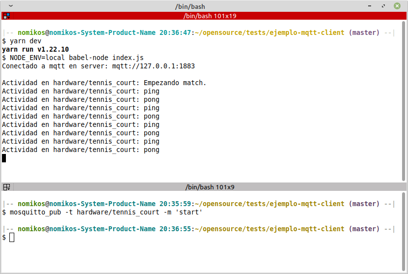

# Ejemplo de conección a servidor mqtt en node.js

## Correr ejemplo
- Clonar repo:
  - git clone https://github.com/NomikOS/mqtt-client.git

- Correr programa:
  - `npm i` o `yarn`
  - `npm run dev` o `yarn dev`

- Empezar el partido: 
  - mosquitto_pub -t hardware/tennis_court -m 'start'

- Debieras ver algo como esto:



---

## Paquetes requeridos en linux para correr mqtt localmente

```
sudo apt-add-repository ppa:mosquitto-dev/mosquitto-ppa  
sudo apt-get update  
sudo apt-get install mosquitto  
sudo apt-get install mosquitto-clients  
sudo apt clean  
```

## Explicación

La parte más importante en la conección inicial a un servidor externo (mqtt, redis, amqp, una database) es poder esperar a que la conección se realize y sólo entonces seguir con la ejecución del resto del programa.

Para esto usamos `import`, `export` de ES6 y `await` 


---


En este archivo `export` permite exponer la variable `mqttClient`, la cual en un principio tiene un valor de `undefined`.

Pero una vez que se llame a la función `mqttClientConnect` esta será sobreescrita con el objeto representando la conneción al servidor, este seré nuestro cliente.


```js
// src/infrastructure/lib/mqttClient.js

export let mqttClient

export function mqttClientConnect() {
  mqttClient = mqtt.connect(env.mqtt.server, {
    username: env.mqtt.username,
    password: env.mqtt.password,
    port: env.mqtt.port,
  })

  // ...
}
```
---

Luego, para poder usar este cliente en cualquier otro archivo usamos `import`. La gracia de esto, es que aún habiendo sido inicializada como `undefined`, una vez que la conección se realice, esta variable se actualizará automáticamente. 

Esto se debe a que `import/export` trabajan mediante referencias y no estáticamente como en CommonJS (muy bien explicado en [What do ES6 modules export?](https://2ality.com/2015/07/es6-module-exports.html))


```js
// src/application/singletons/MqttService.js

import { mqttClient } from "@/infrastructure/lib/mqttClient";

```

Finalmente, en index.js usamos `await` para esperar a que la conneción se realice antes de seguir adelante a ejecutar `hardwareListener.init()` que es donde ya se necesita.

El uso de `una esctructura IIFE` es necesaria para poder uzar `await` ya que estas siempre deben ir dentro de funciones `async`


```js
// index.js

import { env } from "@/infrastructure/lib/env"
import { mqttClientConnect } from "@/infrastructure/lib/mqttClient"
import HardwareListener from "@/interfaces/listeners/HardwareListener"

// IIFE para poder usar await
;(async () => {
  await mqttClientConnect()

  new HardwareListener().init()
})()

```

Tambien podria haberse escrito: 


```js
async function init() {
  await mqttClientConnect()

  new HardwareListener().init()
}

init()

```

## Links:
  - https://2ality.com/2015/07/es6-module-exports.html
  - http://www.steves-internet-guide.com/mosquitto_pub-sub-clients/
  - https://javascript.info/async-await
  - https://developer.mozilla.org/en-US/docs/Glossary/IIFE